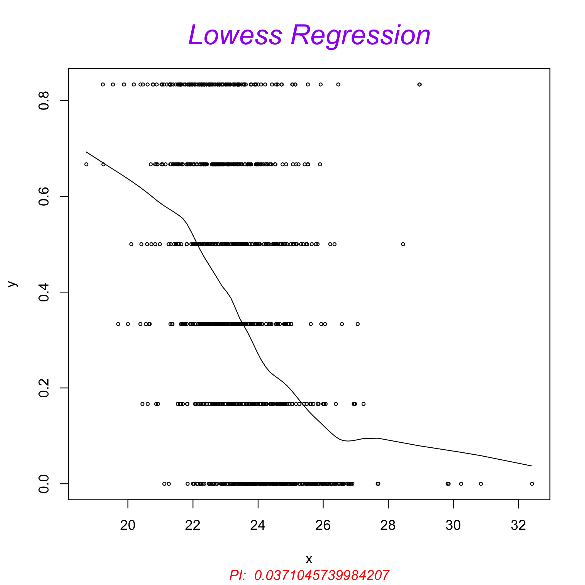

<!-- README.md is generated from README.Rmd. Please edit that file -->


# mi4p 

# A multiple imputation framework for proteomics
## Marie Chion, Christine Carapito and Frédéric Bertrand

<!-- badges: start -->
[](https://lifecycle.r-lib.org/articles/stages.html)
[](https://www.repostatus.org/#active)
[](https://github.com/mariechion/mi4p/actions)
<!--[](https://codecov.io/gh/mariechion/mi4p?branch=master)-->
[](https://cran.r-project.org/package=mi4p)
[](https://cran.r-project.org/package=mi4p)
[](https://github.com/mariechion/mi4p)
<!--[](https://zenodo.org/badge/latestdoi/18441799)-->
<!-- badges: end -->

This repository contains the R code and package for the _mi4p_ methodology (Multiple Imputation for Proteomics), proposed by Marie Chion, Christine Carapito and Frédéric Bertrand (2021) in *Accounting for multiple imputation-induced variability for differential analysis in mass spectrometry-based label-free quantitative proteomics*, [https://arxiv.org/abs/2108.07086](https://arxiv.org/abs/2108.07086). 

The following material is available on the Github repository of the package [https://github.com/mariechion/mi4p/](https://github.com/mariechion/mi4p/).

1. The `Functions` folder contains all the functions used for the workflow.  

2. The `Simulation-1`, `Simulation-2` and `Simulation-3` folders contain all the R scripts and data used to conduct simulated experiments and evaluate our methodology. 

3. The  `Arabidopsis_UPS` and `Yeast_UPS` folders contain all the R scripts and data used to challenge our methodology on real proteomics datasets. Raw experimental data were deposited with the ProteomeXchange Consortium via the PRIDE partner repository with the dataset identifiers PXD003841 and PXD027800.

This website and these examples were created by M. Chion, C. Carapito and F. Bertrand.

## Installation

You can install the released version of mi4p from [CRAN](https://CRAN.R-project.org) with:


```r
install.packages("mi4p")
```

You can install the development version of mi4p from [github](https://github.com) with:


```r
devtools::install_github("mariechion/mi4p")
```

## Examples


```r
library(mi4p)
```


```r
set.seed(4619)
datasim <- protdatasim()
str(datasim)
#> 'data.frame':	200 obs. of  11 variables:
#>  $ id.obs: int  1 2 3 4 5 6 7 8 9 10 ...
#>  $ X1    : num  99.6 99.9 100.2 99.8 100.4 ...
#>  $ X2    : num  97.4 101.3 100.3 100.2 101.7 ...
#>  $ X3    : num  100.3 100.9 99.1 101.2 100.6 ...
#>  $ X4    : num  99.4 99.2 98.5 99.1 99.5 ...
#>  $ X5    : num  98.5 99.7 100 100.2 100.7 ...
#>  $ X6    : num  200 199 199 200 199 ...
#>  $ X7    : num  200 200 202 199 199 ...
#>  $ X8    : num  202 199 200 199 201 ...
#>  $ X9    : num  200 200 199 201 200 ...
#>  $ X10   : num  200 198 200 201 199 ...
#>  - attr(*, "metadata")='data.frame':	10 obs. of  3 variables:
#>   ..$ Sample.name: chr [1:10] "X1" "X2" "X3" "X4" ...
#>   ..$ Condition  : Factor w/ 2 levels "A","B": 1 1 1 1 1 2 2 2 2 2
#>   ..$ Bio.Rep    : int [1:10] 1 2 3 4 5 6 7 8 9 10
```

It is the dataset shipped with package.

```r
save(datasim, file="datasim.RData", compress = "xz")
```


```r
attr(datasim, "metadata")
#>    Sample.name Condition Bio.Rep
#> 1           X1         A       1
#> 2           X2         A       2
#> 3           X3         A       3
#> 4           X4         A       4
#> 5           X5         A       5
#> 6           X6         B       6
#> 7           X7         B       7
#> 8           X8         B       8
#> 9           X9         B       9
#> 10         X10         B      10
```


## AMPUTATION

```r
MV1pct.NA.data <- MVgen(dataset = datasim[,-1], prop_NA = 0.01)
MV1pct.NA.data[1:6,]
#>          X1       X2        X3       X4        X5       X6       X7
#> 1  99.62136  97.3689 100.28075 99.37889  98.48006 200.2803 199.8042
#> 2  99.86342 101.2731 100.86058 99.19046  99.71866 199.2618 200.3934
#> 3 100.21425 100.3024  99.07865 98.51259 100.02675 199.2197 202.2855
#> 4  99.84381 100.2009 101.18119 99.05420 100.18467 200.0615 199.3424
#> 5 100.36412 101.7019 100.59543 99.49536 100.65887 199.2520 199.4715
#> 6 100.70214       NA 101.65048 99.11372 100.94608 201.7471 198.7024
#>         X8       X9      X10
#> 1 201.6095 199.7451 199.7543
#> 2 199.4827 199.7297 198.3984
#> 3 199.7161 198.8883 200.4094
#> 4 199.1865 200.9596 201.2789
#> 5 200.9682 199.9838 198.7303
#> 6 201.8030 199.4030 199.9033
```

## IMPUTATION

```r
MV1pct.impMLE <- multi.impute(data = MV1pct.NA.data, conditions = attr(datasim,"metadata")$Condition, method = "MLE", parallel = FALSE)
```

## ESTIMATION

```r
print(paste(Sys.time(), "Dataset", 1, "out of", 1))
#> [1] "2022-05-11 15:27:11 Dataset 1 out of 1"
MV1pct.impMLE.VarRubin.Mat <- rubin2.all(data = MV1pct.impMLE, metacond = attr(datasim, "metadata")$Condition) 
```

## PROJECTION

```r
print(paste("Dataset", 1, "out of",1, Sys.time()))
#> [1] "Dataset 1 out of 1 2022-05-11 15:28:42"
MV1pct.impMLE.VarRubin.S2 <- as.numeric(lapply(MV1pct.impMLE.VarRubin.Mat, function(aaa){
    DesMat = mi4p::make.design(attr(datasim, "metadata"))
    return(max(diag(aaa)%*%t(DesMat)%*%DesMat))
  }))
```

## MODERATED T-TEST

```r
MV1pct.impMLE.mi4limma.res <- mi4limma(qData = apply(MV1pct.impMLE,1:2,mean), 
                 sTab = attr(datasim, "metadata"), 
                 VarRubin = sqrt(MV1pct.impMLE.VarRubin.S2))
rapply(MV1pct.impMLE.mi4limma.res,head)
#>  logFC.A_vs_B_logFC1  logFC.A_vs_B_logFC2  logFC.A_vs_B_logFC3 
#>           -101.21269            -99.27197           -100.47686 
#>  logFC.A_vs_B_logFC4  logFC.A_vs_B_logFC5  logFC.A_vs_B_logFC6 
#>           -100.07284            -99.11801            -99.82359 
#> P_Value.A_vs_B_pval1 P_Value.A_vs_B_pval2 P_Value.A_vs_B_pval3 
#>              0.00000              0.00000              0.00000 
#> P_Value.A_vs_B_pval4 P_Value.A_vs_B_pval5 P_Value.A_vs_B_pval6 
#>              0.00000              0.00000              0.00000
(simplify2array(MV1pct.impMLE.mi4limma.res)$P_Value.A_vs_B_pval)[1:10]
#>  [1] 0 0 0 0 0 0 0 0 0 0

(simplify2array(MV1pct.impMLE.mi4limma.res)$P_Value.A_vs_B_pval)[11:200]<=0.05
#>   [1] FALSE FALSE FALSE FALSE FALSE FALSE FALSE  TRUE FALSE FALSE
#>  [11] FALSE FALSE  TRUE FALSE FALSE FALSE FALSE FALSE FALSE FALSE
#>  [21] FALSE FALSE FALSE FALSE FALSE FALSE FALSE FALSE FALSE FALSE
#>  [31] FALSE FALSE FALSE FALSE FALSE FALSE  TRUE FALSE FALSE FALSE
#>  [41] FALSE FALSE FALSE FALSE FALSE FALSE FALSE FALSE FALSE FALSE
#>  [51] FALSE FALSE FALSE  TRUE FALSE FALSE FALSE FALSE FALSE FALSE
#>  [61] FALSE  TRUE FALSE FALSE FALSE FALSE FALSE FALSE FALSE FALSE
#>  [71] FALSE FALSE FALSE FALSE FALSE FALSE  TRUE FALSE FALSE FALSE
#>  [81] FALSE FALSE FALSE FALSE FALSE FALSE FALSE FALSE FALSE FALSE
#>  [91] FALSE FALSE FALSE FALSE FALSE FALSE FALSE FALSE FALSE FALSE
#> [101] FALSE FALSE FALSE FALSE FALSE FALSE FALSE FALSE FALSE FALSE
#> [111]  TRUE FALSE FALSE FALSE FALSE FALSE  TRUE FALSE FALSE FALSE
#> [121] FALSE FALSE FALSE FALSE FALSE FALSE FALSE FALSE FALSE FALSE
#> [131] FALSE FALSE FALSE FALSE FALSE FALSE FALSE  TRUE FALSE FALSE
#> [141] FALSE FALSE FALSE FALSE FALSE FALSE FALSE FALSE FALSE FALSE
#> [151] FALSE FALSE FALSE FALSE FALSE FALSE FALSE FALSE FALSE FALSE
#> [161] FALSE FALSE FALSE FALSE FALSE FALSE  TRUE FALSE FALSE FALSE
#> [171] FALSE FALSE FALSE FALSE FALSE FALSE FALSE FALSE FALSE  TRUE
#> [181] FALSE FALSE FALSE FALSE FALSE FALSE FALSE FALSE FALSE FALSE
```

True positive rate

```r
sum((simplify2array(MV1pct.impMLE.mi4limma.res)$P_Value.A_vs_B_pval)[1:10]<=0.05)/10
#> [1] 1
```

False positive rate

```r
sum((simplify2array(MV1pct.impMLE.mi4limma.res)$P_Value.A_vs_B_pval)[11:200]<=0.05)/190
#> [1] 0.05789474
```


```r
MV1pct.impMLE.dapar.res <-limmaCompleteTest.mod(qData = apply(MV1pct.impMLE,1:2,mean), sTab = attr(datasim, "metadata"))
rapply(MV1pct.impMLE.dapar.res,head)
#>  res.l.logFC.A_vs_B_logFC1  res.l.logFC.A_vs_B_logFC2 
#>                -101.212692                 -99.271966 
#>  res.l.logFC.A_vs_B_logFC3  res.l.logFC.A_vs_B_logFC4 
#>                -100.476863                -100.072843 
#>  res.l.logFC.A_vs_B_logFC5  res.l.logFC.A_vs_B_logFC6 
#>                 -99.118007                 -99.823590 
#> res.l.P_Value.A_vs_B_pval1 res.l.P_Value.A_vs_B_pval2 
#>                   0.000000                   0.000000 
#> res.l.P_Value.A_vs_B_pval3 res.l.P_Value.A_vs_B_pval4 
#>                   0.000000                   0.000000 
#> res.l.P_Value.A_vs_B_pval5 res.l.P_Value.A_vs_B_pval6 
#>                   0.000000                   0.000000 
#>                    fit.s21                    fit.s22 
#>                   1.017841                   1.017841 
#>                    fit.s23                    fit.s24 
#>                   1.017841                   1.017841 
#>                    fit.s25                    fit.s26 
#>                   1.017841                   1.017841
```

Simulate a list of 100 datasets.

```r
set.seed(4619)
norm.200.m100.sd1.vs.m200.sd1.list <- lapply(1:100, protdatasim)
metadata <- attr(norm.200.m100.sd1.vs.m200.sd1.list[[1]],"metadata")
```

It is the list of dataset shipped with package.

```r
save(norm.200.m100.sd1.vs.m200.sd1.list, file="norm.200.m100.sd1.vs.m200.sd1.list.RData", compress = "xz")
```

100 datasets with parallel comuting support. Quite long to run even with parallel computing support.

```r
library(foreach)
doParallel::registerDoParallel(cores=NULL)
requireNamespace("foreach",quietly = TRUE)
```

## AMPUTATION

```r
MV1pct.NA.data <- foreach::foreach(iforeach =  norm.200.m100.sd1.vs.m200.sd1.list,
                          .errorhandling = 'stop', .verbose = T) %dopar% 
  MVgen(dataset = iforeach[,-1], prop_NA = 0.01)
```

## IMPUTATION

```r
MV1pct.impMLE <- foreach::foreach(iforeach =  MV1pct.NA.data,
                         .errorhandling = 'stop', .verbose = F) %dopar% 
  multi.impute(data = iforeach, conditions = metadata$Condition, 
               method = "MLE", parallel  = F)
```

## ESTIMATION

```r
MV1pct.impMLE.VarRubin.Mat <- lapply(1:length(MV1pct.impMLE), function(index){
  print(paste(Sys.time(), "Dataset", index, "out of", length(MV1pct.impMLE)))
  rubin2.all(data = MV1pct.impMLE[[index]], metacond = metadata$Condition) 
})
```

## PROJECTION

```r
MV1pct.impMLE.VarRubin.S2 <- lapply(1:length(MV1pct.impMLE.VarRubin.Mat), function(id.dataset){
  print(paste("Dataset", id.dataset, "out of",length(MV1pct.impMLE.VarRubin.Mat), Sys.time()))
  as.numeric(lapply(MV1pct.impMLE.VarRubin.Mat[[id.dataset]], function(aaa){
    DesMat = mi4p::make.design(metadata)
    return(max(diag(aaa)%*%t(DesMat)%*%DesMat))
  }))
})
```

## MODERATED T-TEST

```r
MV1pct.impMLE.mi4limma.res <- foreach(iforeach =  1:100,  .errorhandling = 'stop', .verbose = T) %dopar%
  mi4limma(qData = apply(MV1pct.impMLE[[iforeach]],1:2,mean), 
                 sTab = metadata, 
                 VarRubin = sqrt(MV1pct.impMLE.VarRubin.S2[[iforeach]]))

MV1pct.impMLE.dapar.res <- foreach(iforeach =  1:100,  .errorhandling = 'stop', .verbose = T) %dopar%
  limmaCompleteTest.mod(qData = apply(MV1pct.impMLE[[iforeach]],1:2,mean), 
                        sTab = metadata)
```

Complimentary useful tests

## TESTING FOR ABSENCE/PRESENCE WITH GTEST

The `g.test` function of the`ProteoMM` Bioconductor package, implements the G-Test described in “A statistical framework for protein quantitation in bottom-up MS based proteomics`` (Karpievitch et al. Bioinformatics 2009). For some experimental designs of experiments, this test may be used to look for significant peptides based on their absence/presence. For some designs, it will decrease the precision of out methodology, see the arabidopsis example on github.


```r
library(ProteoMM)
#> 
#> Attachement du package : 'ProteoMM'
#> Les objets suivants sont masqués depuis 'package:mi4p':
#> 
#>     eigen_pi, g.test
ProteoMM::g.test(c(TRUE, TRUE, FALSE, FALSE), as.factor(c('grp1', 'grp1', 'grp2', 'grp2')))
#> 
#> 	Log likelihood ratio/G test of independence
#> 	without correction
#> 
#> data:  c(TRUE, TRUE, FALSE, FALSE) and as.factor(c("grp1", "grp1", "grp2", "grp2"))
#> Log likelihood ratio statistic (G) = 5.5452,
#> X-squared df = 1, p-value = 0.01853
data("qData")
data("sTab")
tableNA.qData <- apply(is.na(qData),1,table,sTab$Condition)
id.mix <- unlist(lapply(tableNA.qData,function(res) nrow(res)>1))
# apply(is.na(qData[id.mix,]),1,g.test,sTab$Condition)
res.g.test <- cbind(rownames=as.data.frame(rownames(qData)[id.mix]),
                    p.val=apply(is.na(qData[id.mix,]),1,
                                function(tab) return(ProteoMM::g.test(x=tab,y=sTab$Condition)$p.value)))
res.g.test[res.g.test[,2]<0.05,]
#>     rownames(qData)[id.mix]       p.val
#> 29                       29 0.003925917
#> 44                       44 0.003925917
#> 105                     105 0.003925917
#> 389                     389 0.003925917
qData[rownames(res.g.test[res.g.test[,2]<0.05,]),]
#>     Intensity_C_R1 Intensity_C_R2 Intensity_C_R3
#> 29        23.18826       22.74154       22.94633
#> 44              NA             NA             NA
#> 105       26.52709       26.37171       26.63201
#> 389             NA             NA             NA
#>     Intensity_D_R1 Intensity_D_R2 Intensity_D_R3
#> 29              NA             NA             NA
#> 44        25.83019       25.98796       26.03095
#> 105             NA             NA             NA
#> 389       22.20932       21.93693       22.03093
```

The `eigen_pi` function of the `ProteoMM` Bioconductor package computes the proportion of observations missing completely at random. It is used by the `g.test` function if such an estimate is to be computed using the data
.

```r
library(ProteoMM)
data(mm_peptides)
intsCols = 8:13
metaCols = 1:7
m_Ints = mm_peptides[, intsCols]
m_prot.info = mm_peptides[, metaCols]
m_logInts = m_Ints
m_logInts[m_Ints==0] = NA
m_logInts = log2(m_logInts)
my.pi = ProteoMM::eigen_pi(m_logInts, toplot=TRUE)
```



